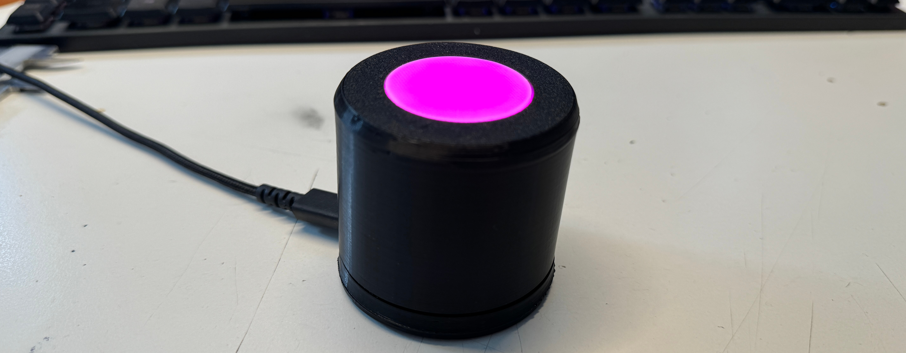
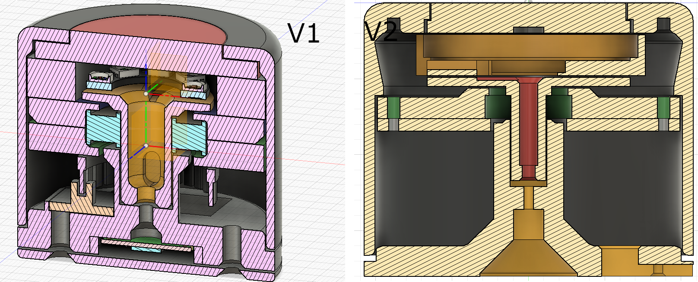

# SmartVolumeKnob

Experience a revolutionary gaming experience with our 3D-printed Fidget Volume Knob!
Bring your music to life and heighten your sensory perception with every twist.
The LED effects add a visual dimension that lights up your room and lifts your mood. Perfect for audiophiles, gamers and anyone who wants to keep their fingers busy.
Get the ultimate companion for your music and gaming session today!

## FEATURES

* Interactive design: Twist, feel and enjoy - The Fidget Volume Knob offers a tactile experience that engages your fingers and stimulates your senses.
High quality material: Made from durable and lightweight 3D printed material that is both sturdy and aesthetically pleasing.
* Compatibility: The Volume Knob is compatible with a wide range of devices, including speaker systems, amplifiers, computers and more. Advanced compatibility allows you to utilize the full potential of your audio equipment.
* Simple setup: Setup is a breeze and requires no special tools.
* Ergonomic design: The ergonomic design of the volume knob ensures comfortable handling and a comfortable gaming experience, whether you're listening to music for hours or enjoying intense gaming sessions.
* Stylish design: With its modern and futuristic design, the Fidget Volume Knob is not only a functional accessory, but also an eye-catcher in any room.
* Versatile use: Whether for listening to music, gaming or simply to relieve stress - the Fidget Volume Knob with LED effects is a versatile accessory that is suitable for any occasion. Thanks to the microcontroller used, all kinds of functions can be realized.

## BOM 

Currently there are two different versions of the `SmartVolumeKnob` labeled  `v1` and `v2`.
The key difference is the size and complexity of the mechanical strucutre.

`V1` is the small variant of the `SmartVolumeKnob` with a footprint of arounf `60mm` in diameter, but the mechanical parts are designed with limited tolerances.
It uses a 3d printed optical encoder consists of one encoder disc and two light barrier modules to form a incremental encoder.

The `V2` is a bigger and more simplified design with a footprint of arounf `110mm`.
To further simplify the design a magnetic absolute encoder is used here instead of the more complicated diy encoder design.

### GENERAL 3D PRINT SETTINGS AND POST PROCESSING STEPS

* Layer height: 0.2mm or 0.1mm for better shell quality
* Support: Support on buildplate only
* Inflill: 10% - 20%
* The screw holes are designed without any large tolerances. So may run a X-Y compensation on your printer first or drill them to size after printing.

For additional haptic and quality improvement, you can print the outher shell led led diffusor using a SLA / SLS printer!

All exported `.stl` files can be found in the `src/cad/<VARIANT>/stl`. All parts as `.step` and the `Fusion360` project files can be found in the parent folder.

After printing all parts use an `debringing tool` on all parts with inner holes ( especially on `bearing_*.stl` parts).

#### MISC

* Soldering Iron
* Cables
* Superglue
* Debringing tool
* Small zip ties
* Some wires to connect the individual modules
* Micro USB cable
  
### V2

#### 3D PRINTED PARTS

#### MECHANICAL

* 13x Heat inserts` M3 Short`
* 1x Bearing `6001RS 12mm x 28mm x 8mm`
* 9x `M3x10 FHCS`
* 4x `M3x40 SHCS`
* 2x - 4x `M2x8` to secure the `Raspberry Pi Pico`, or just use a bit of hotglue or superglue
* `aluminium foil` for the light reflector

  
#### ELECTRICAL

* 1x `Raspberry Pi Pico`
* 21cm of `WS2812 RGB strip` (more LEDs/m equals to  more brightness :)
* 1x `AS5600 Magnetic Angle Encoder` with `diamagnetic magnet`
  
### V1

#### 3D PRINTED PARTS

* `baseplate.stl`
* `bearing_clamp_bottom.stl`
* `bearing_clamp_top.stl`
* `bottom_plate.stl`
* `encder_disc.stl` - print with 0.1mm and remove any stringing!
* `illuminator.stl`
* `illuminator_spacer.stl`
* `led_holder.stl`
* `outher_shell`
    
#### MECHANICAL

* 7x Heat inserts` M3 Short`
* 5x `M3x10 FHCS`
* 2x `M3x25 SHCS`
* 2x - 4x `M2x8` to secure the `Raspberry Pi Pico`, or just use a bit of hotglue or superglue
* 1x Bearing `6001RS 12mm x 28mm x 8mm`

#### ELECTRICAL

* 2x `KY-010`  - Light Barrier Module or 1x `AEDR-8300` optischer optical encoder
* 1x `Raspberry Pi Pico`
* 1x `WS2812 RGB LED Ring 8 LEDs` or `CJMCU-2812-7`

